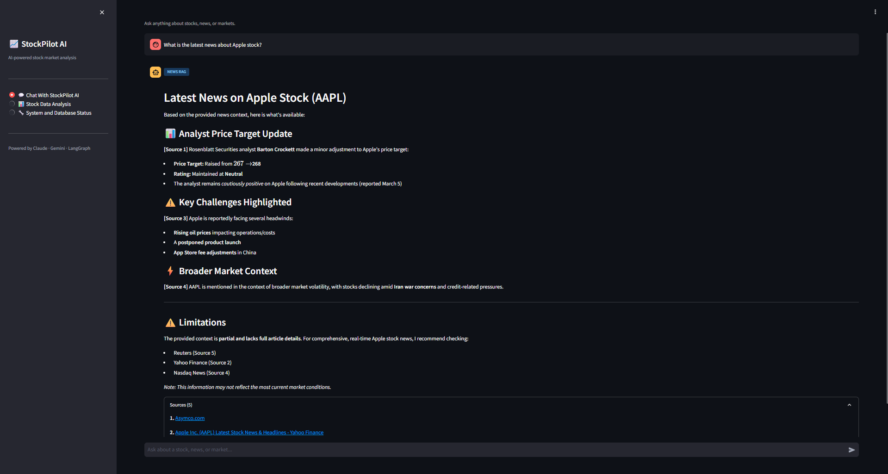
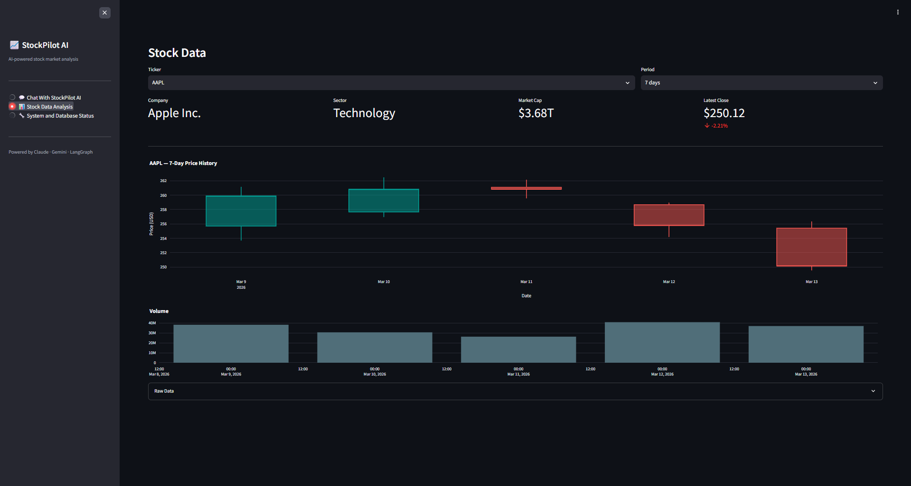
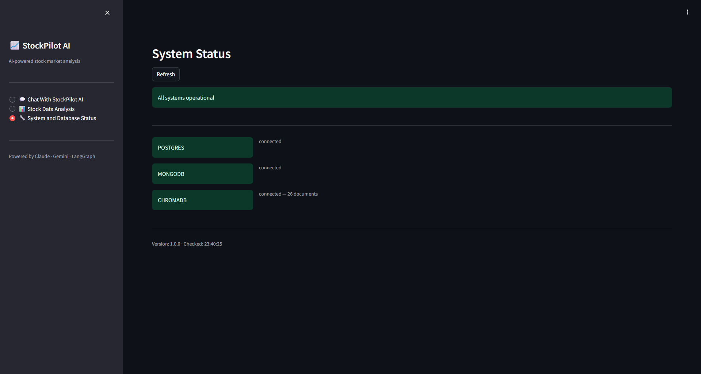
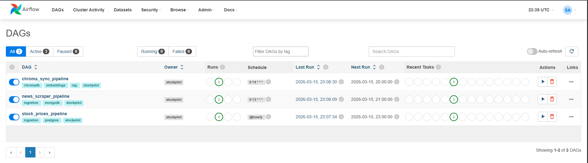
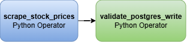
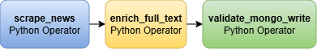
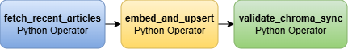

# 🚀 StockPilot AI

> AI-powered stock market analysis agent using LangGraph, Claude AI & Apache Airflow — with real-time data pipelines, agentic RAG workflows, CI/CD, and full AWS EC2 deployment.


**Live Demo:** http://3.209.133.64

---

## 🎯 What is StockPilot AI?

StockPilot AI is a full-stack agentic RAG application that lets you query stock market data and financial news using natural language. It combines real-time data pipelines (Apache Airflow), vector search (ChromaDB), structured data retrieval (PostgreSQL), and a multi-agent LangGraph workflow powered by Claude AI and Gemini embeddings — all deployed on AWS EC2 with a CI/CD pipeline via GitHub Actions.

---

## 📸 Screenshots

### Streamlit UI — Chat with RAG


### Streamlit UI — Stock Data Analysis


### Streamlit UI — System Status


### Airflow DAGs


### DAG 1 — stock_prices_pipeline


### DAG 2 — news_scraper_pipeline


### DAG 3 — chroma_sync_pipeline


---

## 🏗️ Architecture

```
┌──────────────────────────────────────────────────────────────┐
│                    APACHE AIRFLOW                            │
│  DAG 1: stock_prices_pipeline   (@hourly  → PostgreSQL)      │
│  DAG 2: news_scraper_pipeline   (0*/3 *** → MongoDB)         │
│  DAG 3: chroma_sync_pipeline    (0*/4 *** → ChromaDB)        │
└────────────┬──────────────────┬──────────────────┬───────────┘
             ↓                  ↓                  ↓
      ┌─────────────┐   ┌─────────────┐   ┌─────────────┐
      │ PostgreSQL  │   │  MongoDB    │   │  ChromaDB   │
      │ Stock prices│   │ News articles│  │  Embeddings │
      └─────────────┘   └─────────────┘   └─────────────┘
             └──────────────────┴──────────────────┘
                                ↓
┌──────────────────────────────────────────────────────────────┐
│              LANGGRAPH — SUPERVISOR AGENT                    │
│         Claude claude-sonnet-4-6 · Gemini embeddings         │
│                                                              │
│  ┌────────────────┐ ┌────────────────┐ ┌────────────────┐    │
│  │  News RAG      │ │ Stock Data RAG │ │ Stock Charts   │    │
│  │  ChromaDB +    │ │ NL → SQL →     │ │ RAG            │    │
│  │  Web Search    │ │ PostgreSQL     │ │ SQL → Charts   │    │
│  └────────────────┘ └────────────────┘ └────────────────┘    │
└──────────────────────────────┬───────────────────────────────┘
                               ↓
                    ┌─────────────────────┐
                    │   FastAPI Backend   │
                    │   REST API · Docker │
                    └──────────┬──────────┘
                               ↓
                    ┌─────────────────────┐
                    │  Streamlit Frontend │
                    │  Chat · Charts · UI │
                    └─────────────────────┘
                               ↓
              ┌─────────────────────────────────┐
              │  AWS EC2 (c7i-flex.large)       │
              │  Nginx · Docker Compose         │
              │  GitHub Actions CI/CD           │
              └─────────────────────────────────┘
```

---

## 🛠️ Tech Stack

| Layer | Technology |
|---|---|
| **AI Orchestration** | LangGraph, LangChain |
| **Primary LLM** | Anthropic Claude (claude-sonnet-4-6) |
| **Embeddings** | Google Gemini (models/gemini-embedding-001) |
| **Vector Store** | ChromaDB 1.5.3 |
| **Structured DB** | PostgreSQL 15 |
| **Document Store** | MongoDB 7.0 |
| **Data Pipelines** | Apache Airflow 2.9.1 |
| **Backend** | FastAPI |
| **Frontend** | Streamlit |
| **Containerization** | Docker, Docker Compose |
| **Deployment** | AWS EC2 (c7i-flex.large), Nginx |
| **CI/CD** | GitHub Actions |
| **Observability** | LangSmith |

---

## ✨ Features

- **Multi-agent RAG** — LangGraph supervisor routes queries to specialized sub-agents (news, stock data, charts)
- **Real-time data pipelines** — Airflow DAGs scrape and sync data hourly
- **Natural language to SQL** — Ask questions in plain English, get stock data from PostgreSQL
- **News RAG with citations** — ChromaDB vector search + web search with source citations
- **Interactive stock charts** — Candlestick charts with volume from real yfinance data
- **Multi-provider LLMs** — Claude for reasoning, Gemini for embeddings
- **Full CI/CD pipeline** — Push to main → GitHub Actions → auto-deploys to EC2
- **Production Docker stack** — 9 containers orchestrated with Docker Compose

---

## 🗂️ Project Structure

```
Stock-Pilot-AI/
├── .github/
│   └── workflows/
│       └── deploy.yml          # GitHub Actions CI/CD
├── agents/
│   ├── graph.py                # LangGraph supervisor graph
│   ├── news_rag.py             # News RAG sub-agent
│   ├── state.py                # Shared agent state
│   ├── stock_data_rag.py       # Stock data RAG sub-agent
│   ├── supervisor.py           # Supervisor agent logic
│   └── vector_store.py         # ChromaDB integration
├── airflow/
│   ├── dags/
│   │   ├── dag_chroma_sync.py  # ChromaDB sync DAG
│   │   ├── dag_news_scraper.py # News scraper DAG
│   │   └── dag_stock_prices.py # Stock prices DAG
│   └── requirements.txt        # Airflow pip dependencies
├── api/
│   ├── Dockerfile
│   ├── main.py                 # FastAPI app entry point
│   ├── models.py               # Pydantic models
│   └── routes/
│       ├── chat.py             # Chat endpoint
│       ├── health.py           # Health check endpoints
│       └── stocks.py           # Stock data endpoints
├── config/
│   └── config.py               # Centralized config
├── db/
│   └── init_postgres.sql       # PostgreSQL schema
├── docs/
│   └── screenshots/            # README screenshots
├── frontend/
│   ├── Dockerfile
│   └── app.py                  # Streamlit UI
├── scraper/
│   ├── news_scraper.py         # News scraper
│   └── stock_scraper.py        # yfinance stock scraper
├── tests/
│   ├── test_api.py
│   └── test_scrapers.py
├── docker-compose.yml
├── requirements.txt
└── .env.example
```

---

## 🚀 Quick Start (Local)

### Prerequisites
- Docker & Docker Compose
- Python 3.10+
- Anthropic API Key
- Google Gemini API Key

### 1. Clone the repo
```bash
git clone https://github.com/VaibhavSaran/Stock-Pilot-AI.git
cd Stock-Pilot-AI
```

### 2. Setup environment
```bash
cp .env.example .env
# Fill in your API keys in .env
```

### 3. Start all services
```bash
docker compose up -d
```

### 4. Trigger Airflow DAGs (in order)
```
1. stock_prices_pipeline
2. news_scraper_pipeline
3. chroma_sync_pipeline
```

### 5. Access the apps

| Service | URL |
|---|---|
| Streamlit UI | http://localhost:8501 |
| FastAPI Docs | http://localhost:8000/docs |
| Airflow UI | http://localhost:8080 |
| ChromaDB | http://localhost:8001 |

---

## 🌐 AWS Deployment

The project is deployed on AWS EC2 with Nginx as a reverse proxy and GitHub Actions for CI/CD.

### Infrastructure
- **Instance:** AWS EC2 c7i-flex.large (4 vCPU, 4GB RAM)
- **OS:** Ubuntu 24.04 LTS
- **Proxy:** Nginx (port 80 → Streamlit, /api/ → FastAPI, /airflow/ → Airflow)
- **Containers:** 9 Docker containers via Docker Compose

### CI/CD Pipeline
Push to `main` branch → GitHub Actions SSHs into EC2 → `git pull` → `docker compose up --build --force-recreate` → live in ~2 minutes.

### Live URLs

| Service | URL |
|---|---|
| Streamlit UI | http://3.209.133.64 |

---

## 📊 Airflow DAG Pipelines

### DAG 1 — stock_prices_pipeline
```
scrape_stock_prices → validate_postgres_write
```
Fetches OHLCV data for AAPL, MSFT, GOOGL, AMZN, TSLA, NVDA, META via yfinance and upserts into PostgreSQL. Runs hourly.

### DAG 2 — news_scraper_pipeline
```
scrape_news → enrich_full_text → validate_mongo_write
```
Scrapes financial news articles and stores enriched documents in MongoDB. Runs every 3 hours.

### DAG 3 — chroma_sync_pipeline
```
fetch_recent_articles → embed_and_upsert → validate_chroma_sync
```
Reads news from MongoDB, generates Gemini embeddings, upserts into ChromaDB for RAG retrieval. Runs every 4 hours.

---

## 🤝 Credits & Acknowledgements

- **Original inspiration:** [stocks-insights-ai-agent](https://github.com/vinay-gatech/stocks-insights-ai-agent) by [@vinay-gatech](https://github.com/vinay-gatech) — a full-stack LangGraph stock insights application that served as the conceptual foundation for StockPilot AI.
- **Claude AI** — primary LLM for agent reasoning and response generation, with development assistance via Claude API and Claude Code.
- **Google Gemini** — embedding model (models/gemini-embedding-001) for vector search.

---

## 📄 License

GPL-3.0 License — see [LICENSE](LICENSE.md) file for details.
